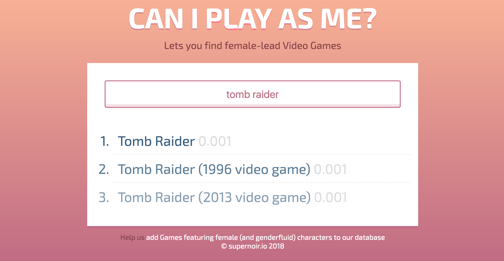

# Can I play as Me?

## Find out if the video game you'd love to play features a female protagonist




## For Contributors
---

### REQUIREMENTS
- You should have Node ^8.9.1 installed
- We use Yarn as package manager
- You should be familiar with the most common git commands
- Installation Guide is geared towards *nix or macOS users. Please get in touch with us for a detailed installation guide under other OSes.

### GENERAL INSTALLATION
- Git clone the repo into your default project directory on your machine:
  ```
  $ git clone git@github.com:supernoir/caniplayasme.git
  ```
- Change into the cloned directory
  ```
  $ cd caniplayasme/
  ```
- Install dependencies with yarn
  ```
  $ yarn install
  ```
- To start coding on the backend, use our server start script:
  ```
  $ yarn start:server
  ```
- To start coding on the frontend, use our app start script:
  ```
  $ yarn start:app
  ```

### TODO
- Unit Test Integration
- Automatic Deploys


### INSTALL SERVER
- Install the server dependencies with